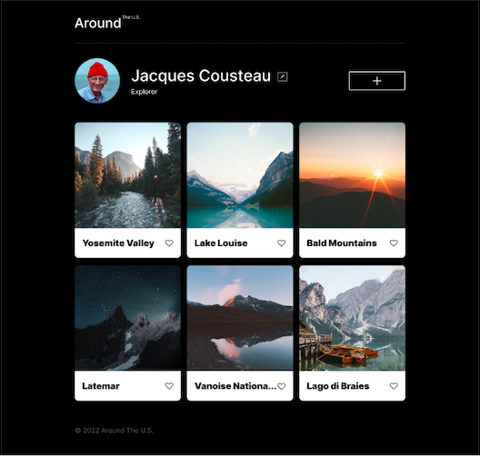
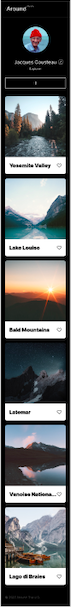
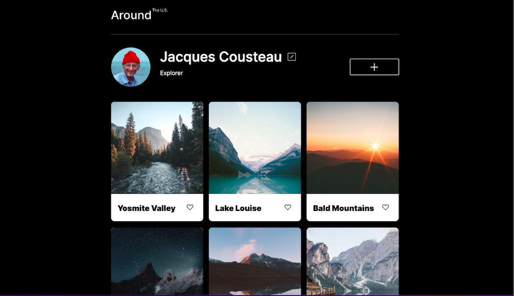
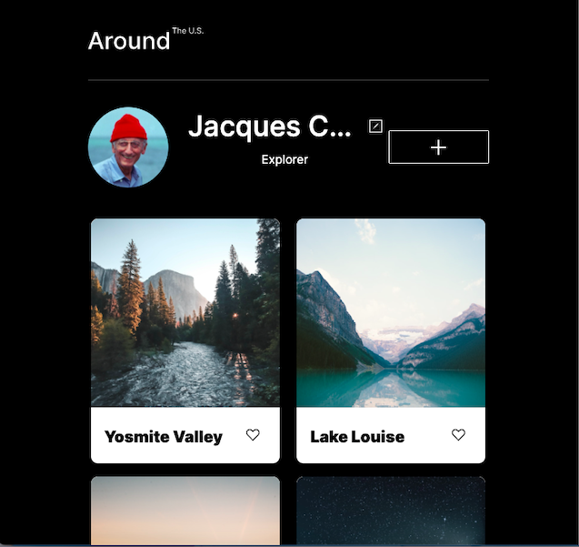
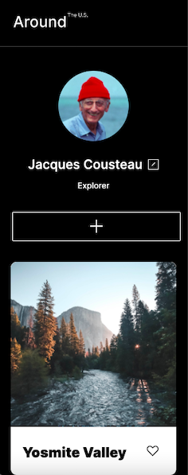
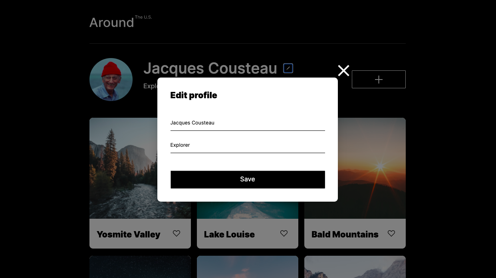
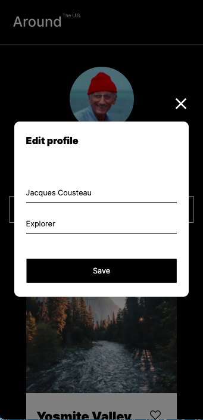

# Project 4: Around The U.S.

### Overview

- Intro
- Figma
- Project features

**Intro**

Around The U.S built for different types of screens. The structure and styles of this project made to practice the skills of building adaptive website. Project has pictures of places and profile of person that potentialy was in this places.

**Link to the website**

https://tata-fritata.github.io/se_project_aroundtheus/

**Figma**

- This project is made using Figma designe.

## Project features

- Semantic HTML5
- Flexbox
- Positioning
- Flat BEM
- Grid
- Media queries
- Adaptive Web Design screen resolution 1280px
- Java script

- Adaptive Web Design screen resolution 900px

- Adaptive Web Design screen resolution 320px

- Popup window and profile form 1280px

- Popup window and profile form 320px

